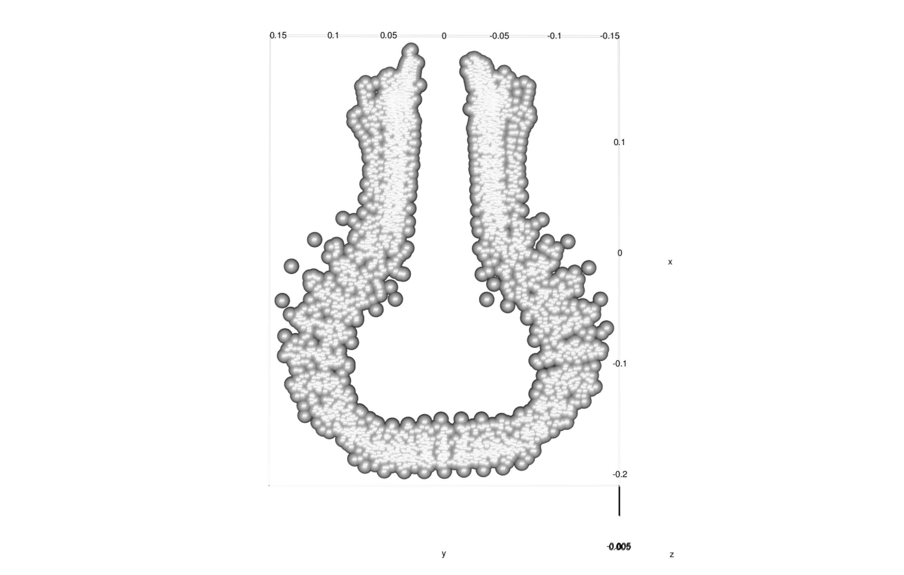
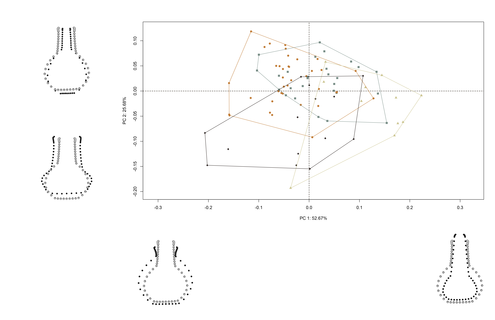
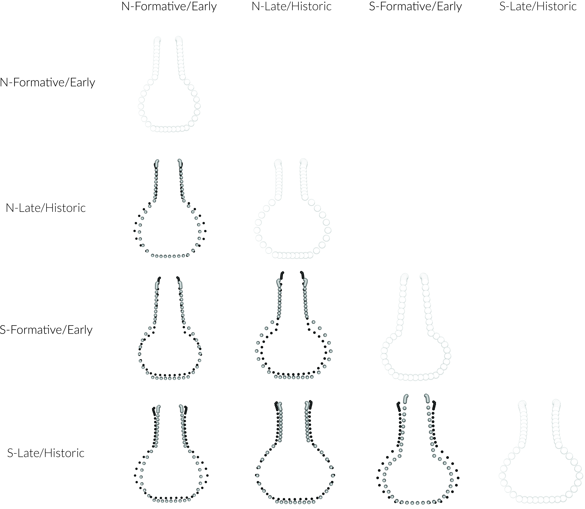
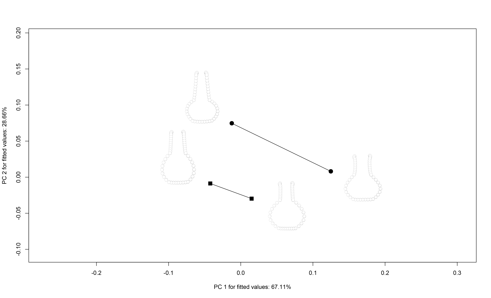

# Analysis of Caddo bottle morphology

## Load packages + data

```{r load.data, echo = TRUE}
# load packages

# devtools::install_github("combmorphR/combmorph", ref = "Stable", build_vignettes = TRUE)
library(here)
library(geomorph)
library(tidyverse)
library(wesanderson)

# read GM data
source('readmulti.csv.R')
setwd("./data")
filelist <- list.files(pattern = ".csv")
coords <- readmulti.csv(filelist)
setwd("../")

# read qualitative data
qdata <- read.csv("qdata.csv", 
                  header = TRUE, 
                  row.names = 1)
qdata <- qdata[match(dimnames(coords)[[3]],
                     rownames(qdata)),]
```

## Generalised Procrustes Analysis

Landmark data were aligned to a global coordinate system [@RN11622;@RN11623;@RN11563], achieved through generalised Procrustes superimposition [@RN478] performed in R 4.0.3 [@R] using the `geomorph` library v. 3.3.2 [@RN11530;@RN1774]. Procrustes superimposition translates, scales, and rotates the coordinate data to allow for comparisons among objects [@RN11564;@RN478]. The `geomorph` package uses a partial Procrustes superimposition that projects the aligned specimens into tangent space subsequent to alignment in preparation for the use of multivariate methods that assume linear space [@RN1646;@RN11563]. 

```{r gpa, out.width = "100%", dpi = 300, echo=TRUE, warning=FALSE}
# gpa
Y.gpa <- gpagen(coords, 
                PrinAxes = TRUE, 
                ProcD = TRUE, 
                Proj = TRUE, 
                print.progress = FALSE)

# output + consensus configuration coords
Y.gpa

# combmorph data frame
gdf <- geomorph.data.frame(shape = Y.gpa$coords, 
                           size = Y.gpa$Csize,
                           geo = qdata$geo,
                           time = qdata$time,
                           comb = qdata$comb)

# render 3d gpa plot
#plot(Y.gpa)

# gpa plot


# add centroid size to qdata
qdata$csz <- Y.gpa$Csize

# print updated qdata with centroid size
knitr::kable(qdata, 
             align = "lccccc", 
             caption = "Modified attributes included in qdata.")
```

## Principal Components Analysis

Principal components analysis [@RN1746] was used to visualise shape variation among the bottles. The shape changes described by each principal axis are commonly visualised using thin-plate spline warping of a reference 3D mesh [@RN1731;@RN479]. 

```{r pca, out.width = "100%", dpi = 300, echo=TRUE, warning=FALSE}
# principal components analysis
pca<-gm.prcomp(Y.gpa$coords)
summary(pca)
```

## Define models

A residual randomisation permutation procedure (RRPP; n = 10,000 permutations) was used for all Procrustes ANOVAs [@RN1655;@RN11775], which has higher statistical power and a greater ability to identify patterns in the data should they be present [@RN1719]. To assess whether shape changes differ by group (geography and time), Procrustes ANOVAs [@RN1749] were also run that enlist effect-sizes (zscores) computed as standard deviates of the generated sampling distributions [@RN1756].

### Size and shape

```{r def.mod.1, out.width = "100%", dpi = 300, echo=TRUE, warning=FALSE}
# size
fit.sz.geo <- procD.lm(size ~ geo,
                data = gdf,
                print.progress = FALSE,
                iter = 9999)

# size
fit.sz.time <- procD.lm(size ~ time,
                data = gdf,
                print.progress = FALSE,
                iter = 9999)

# shape
fit.sh.geo <- procD.lm(shape ~ geo,
                data = gdf,
                print.progress = FALSE,
                iter = 9999)

# shape
fit.sh.time <- procD.lm(shape ~ time,
                data = gdf,
                print.progress = FALSE,
                iter = 9999)

# size.geo
fit.size <- procD.lm(size ~ geo * time,
                data = gdf,
                print.progress = FALSE,
                iter = 9999)

# shape.geo
fit.shape <- procD.lm(shape ~ geo * time,
                data = gdf,
                print.progress = FALSE,
                iter = 9999)
```

## Test Hypothesis

_Hypothesis: Formative/Early and Late/Historic Caddo bottles found north and south of the shape boundary express unique patterns of shape change._

### Boxplot

```{r box1, out.width = "100%", dpi = 300, echo=TRUE, warning=FALSE, fig.cap = "Boxplot of centroid size by spatial/temporal unit."}
# attributes for boxplot
csz <- qdata$csz # centroid size
comb <-  qdata$comb # comb + time

# boxplot of Caddo bottle centroid size by comb (north/south)
csz.comb <- ggplot(qdata, aes(x = comb, y = csz, color = comb)) + 
  geom_boxplot() +
  geom_dotplot(binaxis = 'y', stackdir = 'center', dotsize = 0.3) +
  scale_colour_manual(values = wes_palette("Moonrise2")) +
  theme(legend.position = "none") +
  labs(x = 'North/South + Formative/Early or Late/Historic?', y = 'Centroid Size')

# render plot
csz.comb
```

### Principal Components Analysis

```{r pca1, out.width = "100%", dpi = 300, echo=TRUE, warning=FALSE}
# set plot parameters
pch.gps.comb <- c(15:18)[as.factor(comb)]
col.gps.comb <- wes_palette("Moonrise2")[as.factor(comb)]
col.hull <- c("#C27D38","#798E87","#CCC591","#29211F")

# plot pca by comb
pc.plot <- plot(pca, 
                 asp = 1,
                 pch = pch.gps.comb,
                 col = col.gps.comb)
                    shapeHulls(pc.plot, 
                             groups = comb,
                             group.cols = col.hull)

# pca warp                   

```

### Procrustes ANOVA

```{r h1, out.width = "100%", dpi = 300, echo=TRUE, warning=FALSE}
# ANOVA: do Caddo bottle sizes differ by geo?
anova(fit.sz.geo)

# ANOVA: do Caddo bottle sizes differ by time?
anova(fit.sz.time)

# ANOVA: do Caddo bottle shapes differ by geo?
anova(fit.sh.geo)

# ANOVA: do Caddo bottle shapes differ by time?
anova(fit.sh.time)

# ANOVA: do Caddo bottle sizes differ by geo + time?
anova(fit.size)

# ANOVA: do Caddo bottle shapes differ by geo + time?
anova(fit.shape)
```

### Mean Shapes

```{r mshape.h1, out.width = "100%", dpi = 300, echo=TRUE, warning=FALSE}
# subset landmark coordinates to produce mean shapes
new.coords<-coords.subset(A = Y.gpa$coords, 
                          group = qdata$comb)
names(new.coords)

# group shape means
mean <- lapply(new.coords, mshape)

# plot mean shapes
plot(mean$`north, formative early`)
plot(mean$`north, late historic`)
plot(mean$`south, formative early`)
plot(mean$`south, late historic`)

# comparison plots
plotRefToTarget(mean$`north, formative early`, 
                mean$`north, late historic`, 
                method = c("points"),
                mag = 1)

plotRefToTarget(mean$`north, formative early`, 
                mean$`south, formative early`, 
                method = "points",
                mag = 1)

plotRefToTarget(mean$`north, formative early`, 
                mean$`south, late historic`, 
                method = "points",
                mag = 1)

plotRefToTarget(mean$`north, late historic`, 
                mean$`south, formative early`, 
                method = "points",
                mag = 1)

plotRefToTarget(mean$`north, late historic`, 
                mean$`south, late historic`, 
                method = "points",
                mag = 1)

plotRefToTarget(mean$`south, formative early`, 
                mean$`south, late historic`, 
                method = "points",
                mag = 1)


```

## Trajectory analysis

```{r trajectory, out.width = "100%", dpi = 300, echo=TRUE, warning=FALSE}
# trajectory analysis::shape
TA <- trajectory.analysis(fit.shape, 
                          groups = qdata$geo, 
                          traj.pts = qdata$time, 
                          print.progress = FALSE)

# magnitude difference
summary(TA, attribute = "MD")

# plot
TP <- plot(TA, 
           pch = as.numeric(qdata$geo), 
           bg = as.numeric(qdata$time),
           cex = 0.9,
           col = "gray")
add.trajectories(TP, traj.pch = c(15, 19),
                 start.bg = 1, 
                 end.bg = 2)


```