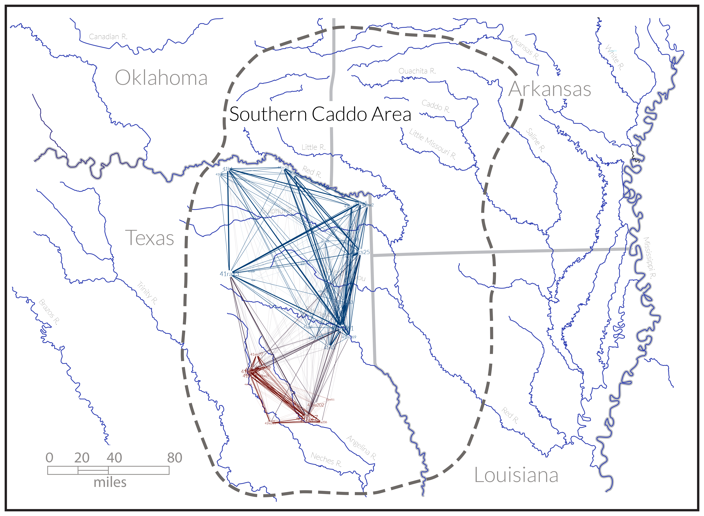

--- 
title: "Patterns of shape change for Caddo bottles recovered from the southern Caddo area"
author: "Robert Z. Selden, Jr."
date: "`r Sys.Date()`"
site: bookdown::bookdown_site
documentclass: book
bibliography: [book.bib]
biblio-style: apalike
link-citations: yes
description: "Morphological analysis of Caddo bottles."
---

# Preface {-}

>Reproducibility---the ability to recompute results---and replicability---the chances other experimenters will achieve a consistent result---are two foundational characteristics of successful scientific research [@RN20918].

This volume is written in **Markdown**, and includes all analysis code employed in the study, providing a means for others to reproduce (exactly) those results discussed and expounded upon in the following chapters. The replicable nature of this undertaking provides a means for others to critically assess and evaluate the various analytical components of this study [@RN20915;@RN20916;@RN20917], which is a necessary requirement for the production of reliable knowledge. Diagnostic types---whether functional, decorative, morphological, or chronological [@RN20847]---are of considerable import in formulating archaeological interpretations. Morphological differences between the northern and southern Caddo bottle shapes have been the topic of recent studies [@RN8074;@RN7927;@RN8370;@RN8312], and geographical (north-south) differences across the same shape boundary have also been noted for Gahagan bifaces [@RN11783;@RN8322] as well as [Perdiz arrow points](https://aksel-blaise.github.io/perdiz2/). 

_The goal of this endeavour is to assess shape change through time for Caddo bottles found in the geographies of the northern and southern Caddo communities of practice, as defined in a recent exploratory network analysis [@RN8031]._

```{r fig.net, fig.cap="Historic Caddo network generated using ceramic and lithic types, which include Perdiz arrow points ([DOI 10.17605/OSF.IO/WD2ZT](https://osf.io/bt2q9/) and Selden, Jr. [-@RN8031]), illustrating two larger north (blue) and south (red) Caddo communities of practice. The communities were identified using a modularity statistic to identify nodes more densely connected to one another than to the rest of the network [@RN8051;@RN8024]."}

```

## Primary findings

* The size of Caddo bottles do not differ significantly by geography, but do differ significantly by time
* The shape of Caddo bottles differ significantly by geography and time
* Patterns of bottle shape in the northern and southern Caddo communities of practice differ significantly

## Acknowledgments

I extend my gratitude to the Caddo Nation of Oklahoma,the Material Sciences Laboratory at Southern Methodist University, the Williamson Museum at Northwestern State University, the Louisiana State Exhibit Museum, the Texas Archeological Research Laboratory at The University of Texas at Austin, and the Louisiana State University Museum of Natural Science for the requisite permissions, access, and space needed to generate 3D scans of Caddo bottles. Thanks also to Dean C. Adams, Michael L. Collyer, Emma Sherratt, Michael J. Shott, Hiram F. (Pete) Gregory, B. Sunday Eiselt, Julian A. Sitters, and Kersten Bergstrom for their constructive criticisms, comments, and suggestions throughout the development of this research programme, and the anonymous reviewers whose comments improved the manuscript. 

## Funding

Development of the analytical work flow and production of 3D scans from the Turner and Webb collections was funded by a grant to the author (P14AP00138) from the National Center for Preservation Technology and Training. Production of 3D scan data for Hickory Engraved and Smithport Plain bottles from the Texas Archeological Research Laboratory was funded by a grant from the Texas Archeological Society, and collection of 3D scan data for previously repatriated Caddo bottles was funded by a grant from the Caddo Nation of Oklahoma.

## Data management

The data and analysis code associated with this project can be accessed through this document or the [GitHub](https://github.com/aksel-blaise/bottle.traj) repository, which is digitally curated on the Open Science Framework ([DOI: 10.17605/OSF.IO/GH7VZ](https://osf.io/gh7vz/)).