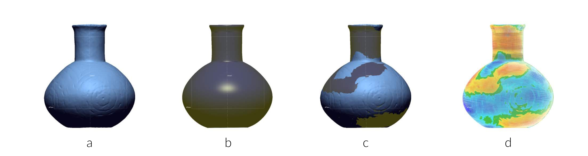

--- 
title: "Which way toward the maker? Patterns of shape change in Caddo bottles"
author: "Robert Z. Selden, Jr."
date: "`r Sys.Date()`"
site: bookdown::bookdown_site
documentclass: book
bibliography: [book.bib]
biblio-style: apalike
link-citations: yes
description: "Morphological analysis of Caddo bottles."
---

# Preface {-}

>Reproducibility---the ability to recompute results---and replicability---the chances other experimenters will achieve a consistent result---are two foundational characteristics of successful scientific research [@RN20918].

This volume is written using _Markdown_, and includes all analysis code employed in the study, providing a means for others to reproduce (exactly) those results discussed and expounded upon in the following chapters. The replicable nature of this undertaking provides a means for others to critically assess and evaluate the various analytical components of this study [@RN20915;@RN20916;@RN20917], which is a necessary requirement for the production of reliable knowledge.

## Basis of inquiry

In a June 18, 1937 WPA interview with Lillian Cassaway, Sadie Bedoka---a Caddo-Delaware woman who was raised wth the Caddo---states that:

>Each [Caddo] clan had its own shape to make its pottery. One clan never thought of making anything the same pattern of another clan. **_You could tell who made the pottery by the shape_** [@RN9357x, 395].

Diagnostic types---whether `functional`, `decorative`, `morphological`, or `chronological` [@RN20847]---are of considerable import in formulating archaeological interpretations; however, the Caddo ceramic types are based upon decorative motifs, and not morphology [@RN5769;@RN7795]. Morphological differences between the northern and southern Caddo bottle shapes have been the topic of recent studies [@RN8074;@RN7927;@RN8370;@RN8312], where a _shape boundary_ was posited. More recently, morphological differences were also found to occur across the same _shape boundary_ for Gahagan bifaces [@RN11783;@RN8322] and [Perdiz arrow points](https://aksel-blaise.github.io/perdiz2/). 

In recent analyses of Caddo bottle morphology [@RN8074;@RN7927;@RN8370;@RN8312], vessels of the same `decorative` types were found to differ in morphology across a specific geographic range. It is not known whether the same Caddo maker that crafted a vessel's shape also applied the various decorative elements; however, if the maker is also assumed to have applied the motif, then it may be the case that Caddo vessel shapes and decorative elements incorporate discrete components of cultural signals, similar to the _autogenous_ and _adherent_ signals proposed by Kubler [-@RN8105].

The analysis builds directly upon those insights provided by Sadie Bedoka, adding a temporal component to assess whether (general) Caddo bottle shapes from the northern and southern Caddo communities of practice differ through time. A recent analysis of [French trade axes](https://github.com/aksel-blaise/fta3dgm/blob/main/fta2dgm.md) successfully identified the morphological idiosyncracies of French blacksmiths, and a current study of [Caddo ceramic incision morphology](https://aksel-blaise.github.io/incision/) is extending the reach of morphological studies by asking if it may be possible to identify whether Caddo makers used a standard tool (or toolkit) to apply the diverse decorative motifs that adorn Caddo ceramics. 

In studies of ceramic morphology, an analysis of bilateral/object symmetry can yield useful insights related to _design intent_, provided it is assumed that the goal of the potter was to produce a symmetrical vessel. Within that framework, deviation from bilateral symmetry (fluctuating asymmetry) might serve as a useful measure of _production stability_, _differential production practices_, and/or _skill_. The landmarking protocol developed for this study incorporates the widest vessel profile, which can be revolved 360-degrees to render a fully-symmetrical 3D model of each vessel in the sample. That model can, in turn, be used to calculate the deviation from the 3D model [@RN11521]. The analysis also uses geometric morphometrics as a means of assessing whether the Caddo bottles---if bilaterally symmetrical---differ by geography and through time.

```{r fig.asymmetry.x, fig.cap="Deviations from axial symmetry enlist the unique mesh of each bottle (a), then revolve sketch of the widest vessel profile identified in the GM study to produce a symmetrical surface model (b) that is built atop the mesh (c), and used to calculate deviations between the symmetrical surface model and the mesh (d)."}

```

This exploratory study enlists a novel, and replicable, 3D landmarking protocol that provides a means of further parsing Caddo bottles into discrete components (i.e., rim, neck, body, and base). If the hypothesis is supported in the analysis of whole bottles, subsequent analyses will be run to identify which morphological component---or suite of components---are driving the pattern.

_The goal of this endeavour is to assess shape change through time for Caddo bottles found in the geographies of the northern and southern Caddo communities of practice, as defined in a recent exploratory network analysis [@RN8031]._

While this study does not yet move beyond an analysis of the larger northern and southern Caddo communities of practice, it expands the previously identified _shape boundary_ [@RN20852] westward into Texas. It remains a goal of this research programme to expand the analysis to include as many Caddo bottles as possible, as a means of exploring whether it might be possible to identify individual---or small groups of---Caddo makers through analyses of complex bottle morphology.

```{r fig.map, fig.cap="Location of archaeological sites with Caddo bottles represented in the current sample."}
knitr::include_graphics('./images/fig.map.jpg')
```

## Primary findings

### Analysis of whole bottle morphology

* Caddo bottle size **does not differ** significantly by geography, but **differs** significantly by time
* Caddo bottle shape **differs** significantly by geography and time
* Caddo bottle shape trajectories **differ** significantly through time for the northern and southern Caddo communities of practice

### Analysis of components

* Caddo bottle _rim_ shape **differs** significantly by time
* Caddo bottle _neck_ shape and size **differs** significantly by and through time
* Caddo bottle _body_ shape **differs** significantly by geography and time
* Caddo bottle _base_ size **differs** significantly by time

## Acknowledgments

I extend my gratitude to the Caddo Nation of Oklahoma, the Material Sciences Laboratory at Southern Methodist University, the Williamson Museum at Northwestern State University, the Louisiana State Exhibit Museum, the Texas Archeological Research Laboratory at The University of Texas at Austin, and the Louisiana State University Museum of Natural Science for the requisite permissions, access, and space needed to generate 3D scans of Caddo bottles. Thanks also to Dean C. Adams, Michael L. Collyer, Emma Sherratt, Michael J. Shott, Hiram F. (Pete) Gregory, B. Sunday Eiselt, Julian A. Sitters, and Kersten Bergstrom for their constructive criticisms, comments, and suggestions throughout the development of this research programme, and the anonymous reviewers whose comments improved the manuscript. 

## Funding

Development of the analytical work flow and production of 3D scans from the Turner and Webb collections was funded by a grant to the author (P14AP00138) from the National Center for Preservation Technology and Training. Production of 3D scan data for Hickory Engraved and Smithport Plain bottles from the Texas Archeological Research Laboratory was funded by a grant from the Texas Archeological Society, and collection of 3D scan data for previously repatriated Caddo bottles was funded by a grant from the Caddo Nation of Oklahoma.

## Data management

The data and analysis code associated with this project can be accessed through this document or the [GitHub](https://github.com/aksel-blaise/bottle.traj) repository, which is digitally curated on the Open Science Framework ([DOI: 10.17605/OSF.IO/GH7VZ](https://osf.io/gh7vz/)).

## Colophon

This version of the analysis was generated on `r Sys.time()` using the following computational environment and dependencies: 

```{r colophon, cache = FALSE}
# what R packages and versions were used?
if ("devtools" %in% installed.packages()) devtools::session_info()
```

Current Git commit details are:

```{r}
# where can I find this commit? 
if ("git2r" %in% installed.packages() & git2r::in_repository(path = ".")) git2r::repository(here::here())  
```
