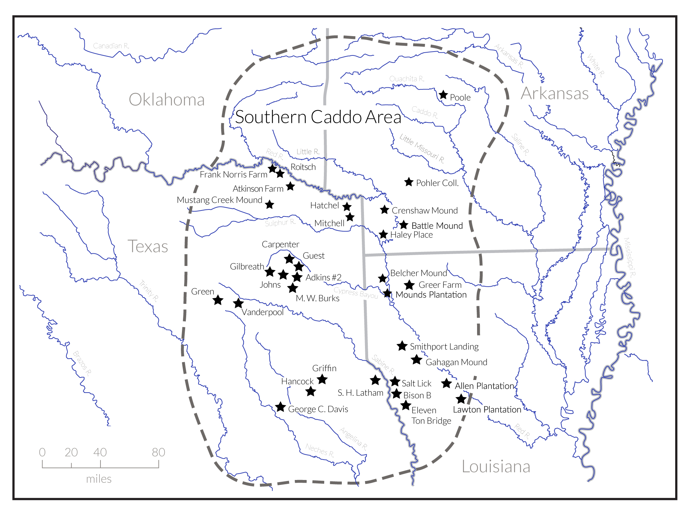

--- 
title: "Which way toward the maker? Patterns of shape change in Caddo bottles"
author: "Robert Z. Selden, Jr."
date: "`r Sys.Date()`"
site: bookdown::bookdown_site
documentclass: book
bibliography: [book.bib]
biblio-style: apalike
link-citations: yes
description: "Analysis of shape change in Caddo bottle morphology."
---

# Preface {-}

>Reproducibility---the ability to recompute results---and replicability---the chances other experimenters will achieve a consistent result---are two foundational characteristics of successful scientific research [@RN20918].

This volume is written using _Markdown_, and includes all analysis code employed in the study, providing a means for others to reproduce (exactly) those results discussed and expounded upon in the following chapters. The replicable nature of this undertaking provides a means for others to critically assess and evaluate the various analytical components of this study [@RN20915;@RN20916;@RN20917], which is a necessary requirement for the production of reliable knowledge.

## Basis of inquiry

In a June 18, 1937 WPA interview with Lillian Cassaway, Sadie Bedoka---a Caddo-Delaware woman who was raised wth the Caddo---states that:

>Each [Caddo] clan had its own shape to make its pottery. One clan never thought of making anything the same pattern of another clan. **_You could tell who made the pottery by the shape_** [@RN9357x, 395].

Diagnostic types---whether `functional`, `decorative`, `morphological`, or `chronological` [@RN20847]---are of considerable import in formulating archaeological interpretations; however, the Caddo ceramic types are based primarily upon decorative motifs, and not morphology [@RN5769;@RN7795]. In recent analyses of Caddo bottle morphology [@RN8074;@RN7927;@RN8370], vessels of the same `decorative` types (Hickory Engraved and Smithport Plain) were found to differ in morphology when recovered from discrete geographical regions. Those studies were subsequently expanded to include a variety of Formative/Early and Late/Historic Caddo bottles---from the same regions---to assess whether the shape differences identified in the Hickory Engraved and Smithport Plain vessels extend to Caddo bottles generally, and whether those shapes differed through time [@RN8312].

It remains unknown whether the same Caddo potter that crafted the vessel's form also applied the various decorative elements; however, if the same potter is assumed to have applied the motif, then it may be the case that Caddo vessel shapes and decorative elements were intended to incorporate discrete cultural signals. More recently, morphological differences were found to occur across the same geography for Gahagan bifaces [@RN11783;@RN8322] and [Perdiz arrow points](https://aksel-blaise.github.io/perdiz2/), lending further support to the spatial hypothesis. While the present study does not yet move beyond an analysis of the larger northern and southern Caddo communities of practice, it expands the previously identified _shape boundary_ [@RN20852] westward into Texas.

_The goal of this endeavour is to assess shape change through time for Caddo bottles found in the geographies of the northern and southern Caddo communities of practice, as defined in a recent exploratory network analysis [@RN8031]._

```{r fig.map, fig.cap="Archaeological site locations associated with Caddo bottles used in the study."}

```

## Primary findings

* Caddo bottle shape **differs** significantly by geography and through time
* Caddo bottle shape trajectories **differ** significantly through time in the northern and southern Caddo communities of practice

## Acknowledgments

I extend my gratitude to the Caddo Nation of Oklahoma, the Material Sciences Laboratory at Southern Methodist University, the Williamson Museum at Northwestern State University, the Louisiana State Exhibit Museum, the Texas Archeological Research Laboratory at The University of Texas at Austin, and the Louisiana State University Museum of Natural Science for the requisite permissions, access, and space needed to generate 3D scans of Caddo bottles. Thanks also to Dean C. Adams, Michael L. Collyer, Emma Sherratt, Michael J. Shott, Hiram F. (Pete) Gregory, B. Sunday Eiselt, and Kersten Bergstrom for their constructive criticisms, comments, and suggestions throughout the development of this research programme, as well as the editors and anonymous reviewers whose comments improved the manuscript. 

## Funding

Development of the analytical work flow and production of 3D scans from the Turner and Webb collections was funded by a grant to the author (P14AP00138) from the National Center for Preservation Technology and Training. Production of 3D scan data for Hickory Engraved and Smithport Plain bottles from the Texas Archeological Research Laboratory was funded by a grant from the Texas Archeological Society, and collection of 3D scan data for previously repatriated Caddo bottles was funded by a grant from the Caddo Nation of Oklahoma.

## Data management

The data and analysis code associated with this project can be accessed through this document or the [GitHub](https://github.com/aksel-blaise/bottle.traj) repository, which is digitally curated on the Open Science Framework ([DOI: 10.17605/OSF.IO/GH7VZ](https://osf.io/gh7vz/)).

## Colophon

This version of the analysis was generated on `r Sys.time()` using the following computational environment and dependencies: 

```{r colophon, cache = FALSE}
# what R packages and versions were used?
if ("devtools" %in% installed.packages()) devtools::session_info()
```

Current Git commit details are:

```{r}
# where can I find this commit? 
if ("git2r" %in% installed.packages() & git2r::in_repository(path = ".")) git2r::repository(here::here())  
```
